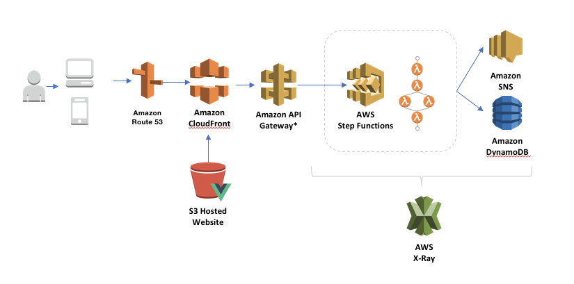

## AWS Step Functions Plagiarism Demo Dotnetcore

A simple workflow for developing AWS Step Functions to demonstrate how you can combine AWS Step Functions with AWS Lambda using DotNetCore 2.0, and the Serverless Application Model (SAM), and expose your workflow via an API Gateway!

### The Scenario

To illustrate the use of [AWS Step Functions](https://aws.amazon.com/step-functions/) I have created a scenario that describes a process where university students caught plagiarising on exams and/or assignments are required to take a test to assess their knowledge of the universities referencing standards.

Visually, the process looks like this:

The process starts by:

1. Registering the plagiarism incident
2. Scheduling an exam. Students have one week to complete the test.
3. Send the student an email notification to inform them of the requirement
4. The process waits for the exam deadline to complete, before
5. Validating the results
6. Determining whether or not the student has sat the exam, or passed. Students get three attempts to pass the exam before...
    * The incident is resolved, or
    * Administrative action is taken.

### The Architecture

This example uses a simple architecture, hosting a static website in [Amazon Simple Storage Service](https://aws.amazon.com/s3/) (Amazon S3) using Vue.js to invoke an [Amazon API Gateway](https://aws.amazon.com/api-gateway/) API. The API is configured with an AWS Service integration which invokes the [AWS Step Function](https://aws.amazon.com/step-functions/) state machine for the plagiarism workflow. Along the way, the task states in the state machine are executing [AWS Lambda](https://aws.amazon.com/lambda/) functions which are periodically persisting data to [Amazon DynamoDB](https://aws.amazon.com/dynamodb/) and send messages via [Amazon Simple Notification Service](https://aws.amazon.com/sns/).

## Resources

### Step Functions

* [AWS Step Functions](https://aws.amazon.com/step-functions/)
* [AWS Step Functions Developer Guide](https://docs.aws.amazon.com/step-functions/latest/dg/welcome.html)
* [statelint](https://github.com/awslabs/statelint)
* [Amazon States Language](https://states-language.net/spec.html)
* [Step Functions Ruby Activity Worker](https://github.com/aws-samples/step-functions-ruby-activity-worker) example

### Reference Architectures

* [Serverless Reference Architecture: Image Recognition and Processing Backend](https://github.com/awslabs/lambda-refarch-imagerecognition)
* [Serverless Reference Architecture: Snapshot Management](https://github.com/awslabs/aws-step-functions-ebs-snapshot-mgmt)
* [Batch Architecture for Life Sciences Workloads](https://github.com/awslabs/aws-batch-genomics)
* [S3 Bucket Sync Reference](https://github.com/awslabs/sync-buckets-state-machine)
* [Step Functions Plug-In for Serverless Framework](https://github.com/horike37/serverless-step-functions)

### AWS Developer Resources

* [Serverless Application Model](https://github.com/awslabs/serverless-application-model)
* [DevOps and AWS](https://aws.amazon.com/devops/)
* [AWS Developer Tools](https://aws.amazon.com/products/developer-tools/)

## License Summary

This sample code is made available under a modified MIT license. See the LICENSE file.
